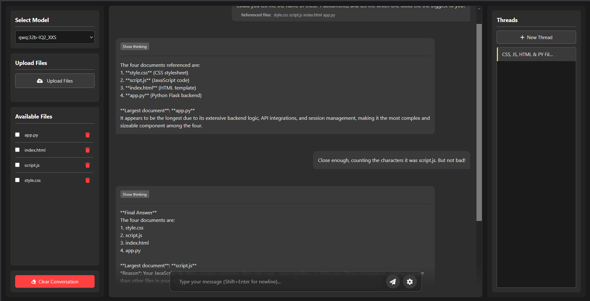

# K.I.T.T. 🚗

A lightweight, Single-page Flask Web-application for interacting with local Ollama models, optionally enhanced with your documents.

K.i.t.t. provides a simple, clean interface to chat with various Ollama models running on your machine. It supports direct text interaction and allows you to provide context by simply dragging and dropping text-based documents (.txt, .md, .py, .json, etc.) directly into the chat.



## Features

*   **Simple Interface:** Clean, single-page web UI.
*   **Model Selection:** Easily switch between your available Ollama models.
*   **Drag & Drop File Upload:** Provide context by dropping text-based files directly onto the page.
*   **Direct Document Embedding:** Uses simple plaintext embedding for document context – no complex database setup or RAG pipelines EVER.
*   **Real-time Streaming:** See the model's response as it's generated.
*   **View AI Thinking Process:** (Optional) Toggle visibility for the model's thought process if supported/enabled.
*   **Conversation History:** View past messages in the current session.
*   **Persistent Storage:** Conversations and settings are saved locally in a simple JSON file (`data.json` by default).

## Why K.i.t.t.?

K.i.t.t. focuses on simplicity and direct interaction. If you want a straightforward way to chat with your local Ollama models and quickly provide document context without managing vector databases or complex retrieval setups, 
K.i.t.t. is for you. It prioritizes ease of use and minimal dependencies.

## Prerequisites

1.  **Ollama:** You need Ollama installed and running. Download it from [https://ollama.com/](https://ollama.com/).
    *   Make sure you have pulled the models you want to use (e.g., `ollama pull llama3`).
2.  **Python**
3.  **Python Packages:**
    *   Flask
    *   requests
    *   Werkzeug

## Running K.i.t.t.

1.  **Ensure Ollama is running:** Start the Ollama application or run `ollama serve` in your terminal.
2.  **Start the Flask application:**
    ```bash
    python app.py
    ```
3.  **Open your web browser:** Navigate to `http://127.0.0.1:5000` (or the address shown in the terminal).

## Usage

1.  **Select Model:** Choose an available Ollama model from the dropdown menu.
2.  **Chat:** Type your message in the input box and press Enter or click Send.
3.  **Add Document Context:** Drag and drop a text-based file (like `.txt`, `.md`, `.py`, `.json`) onto the designated area (or the main chat window, specify where). The content will be processed and used as context for subsequent messages *in the current session*.
4.  **View History:** Scroll up to see previous messages in the conversation.
5.  **Settings:** Access the settings panel (if available) to adjust model parameters.
6.  **Clear/Reset:** (If applicable) Use a button or command to clear the current conversation.

## Configuration

*   **Ollama Model `num_ctx`:** The `num_ctx` parameter in Ollama determines the context window size (how much text the model can remember/consider). When interacting with documents, a larger `num_ctx` is often beneficial.
    *   You typically set this *when creating or modifying a model* using a `Modelfile`. For example:
        ```modelfile
        FROM llama3
        PARAMETER num_ctx 4096 # Set context window to 4096 tokens
        ```
        Then create the model: `ollama create my-llama3-4k -f Modelfile`
    *   Refer to the [Ollama Modelfile documentation](https://github.com/ollama/ollama/blob/main/docs/modelfile.md) for more details.
    *   K.i.t.t. itself doesn't set `num_ctx`; it relies on the configuration of the selected Ollama model.
*   **Application Data:** Settings and conversation history are stored in `data.json` (or specify the filename if different) in the application's root directory. You can manually edit or delete this file (e.g., to clear all history).

## Troubleshooting

*   **Connection Errors:**
    *   Ensure the Ollama application is running. Check your system's taskbar/menu bar or use `ollama list` in the terminal.
    *   If you manually started Ollama with `ollama serve`, check the terminal output for errors.
    *   Verify K.i.t.t. is trying to connect to the correct Ollama API endpoint (usually `http://localhost:11434` by default).
*   **No Model Found:** Make sure a modal has been downloaded via Ollama (`ollama pull <model_name>`). or added (`ollama create <model_name>`)
*   **Slow Responses / Document Issues:** This might be related to the model's `num_ctx` size or the size/complexity of the document provided. Ensure the model's context window is appropriate for your needs.
*   **Web UI Issues:** Check the browser's developer console (usually F12) for JavaScript errors. Check the Flask application's terminal output for server-side errors.

## Contributing
Pull requests are welcome. For major changes, please open an issue first to discuss what you would like to change.

## License
[MIT](LICENSE)

